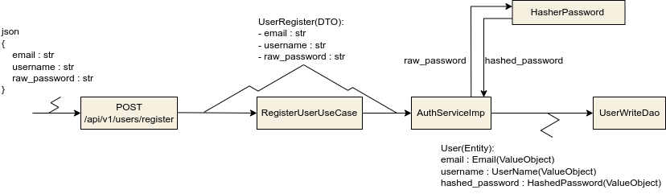
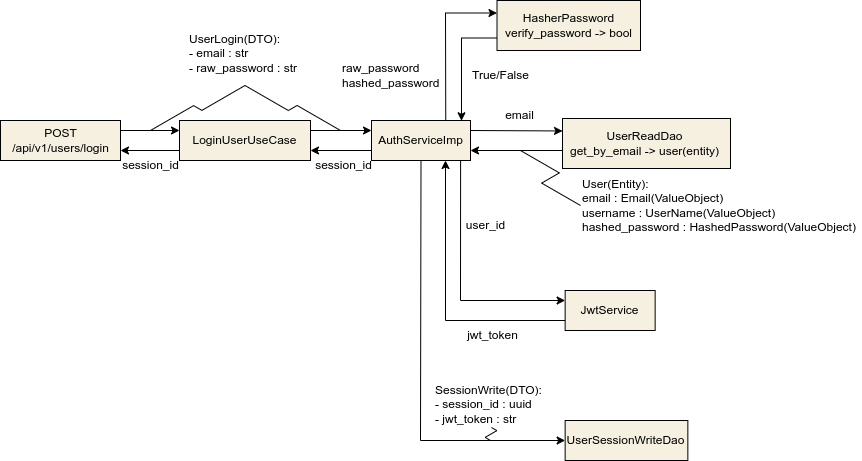
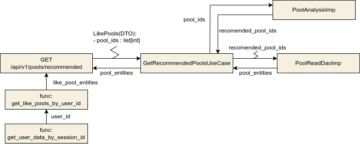
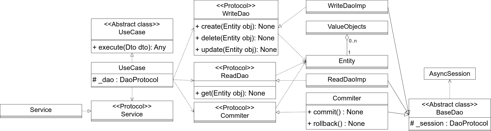

# Pool_search_assistant
Сервис API для получения рекомендованных бассейнов.

Ссылка на документацию по API: https://miheev.su/pool/api/v1/docs

В директории docs находится более подробная пояснительная записка к проекту

 
 
 
 
 
 

## Функционал:
- Авторизация пользователей через сессии
- Сохранение информации о понравившихся бассейнах пользователя
- Выдача рекомендованных бассейнов, на основе понравившихся.
- Обновление данных датасета в полу-автоматическом режиме

### Обновление датасета:
Через cli команду, запускается скрипт, который ходит в API с открытыми данными города Москва.
### Выдача рекомендаций:
Рекомендация основана на алоритме нахождения косинусного растояния между двумя векторами
### Сессии пользователей:
При авторизации (перед этим нужно зарегестрироваться) выдается id сессии(uuid), информация о сессии хранится в Redis в виде jwt токена.

## Основные кейсы:
- Регистрация

- Авторизация

- Получение рекомендаций

## Архитектура:
Монолит (Clean Arhitecture).

### Разделение слоев, и направления зависимостей.

### ER-диаграмма базы данных PostgreSQL в нотации Мартина.

### Обощенная диаграмма классов.

